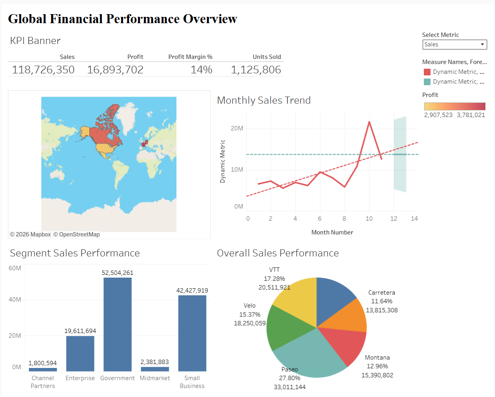

# Global Financial Performance Executive Dashboard

**[🔗 View the Interactive Dashboard on Tableau Public](https://public.tableau.com/views/GlobalFinancialPerformanceOverview/GlobalPerformance?:language=en-US&:sid=&:redirect=auth&:display_count=n&:origin=viz_share_link)**

## 📌 Project Overview
This project features an interactive, executive-level Business Intelligence dashboard built in Tableau. It is designed to empower stakeholders to analyze global financial performance, track B2B sales trends, and evaluate profitability across multiple international markets, product lines, and business segments.

The dashboard utilizes advanced Tableau mechanics to provide a seamless, dynamic user experience, allowing executives to quickly drill down from high-level KPIs to granular regional performance.

## 🛠️ Technical Skills & Features Showcased
* **Dynamic Parameter Controls:** Engineered a custom `Select Metric` parameter allowing users to toggle the entire dashboard's context between **Sales** and **Profit** dynamically.
* **Level of Detail (LOD) Expressions:** Implemented advanced LOD calculations to accurately compute metrics such as `% of Country Total Sales` regardless of applied filters.
* **Custom Calculated Fields:** Created specific financial KPI measures including *Profit Margin %* and *Target Sales* variance.
* **Interactive UI/UX Design:** * Configured complex **Dashboard Action Filters**, transforming the geographic map into a central control hub that dynamically filters the Monthly Trend, Overall Performance, and Segment Performance charts.
  * Utilized dynamic chart titles that update automatically based on the user's parameter selection.
  * Locked fixed-size formatting for a consistent, professional viewing experience across all web browsers.

## 📊 Dashboard Components
1. **KPI Banner:** High-level summary of total Sales, Profit, Profit Margin %, and Units Sold.
2. **Interactive Geographic Map:** Visualizes performance across 5 key markets (USA, Germany, France, Canada, Mexico) and acts as the primary global filter.
3. **Monthly Performance Trend:** A time-series analysis tracking the selected metric (Sales or Profit) over the fiscal year.
4. **Segment Performance (Bar Chart):** Breaks down performance by B2B customer segments (e.g., Enterprise, Government, Midmarket).
5. **Overall Product Performance (Pie Chart):** Illustrates the proportional contribution of individual product lines to the total selected metric.

## 📁 Repository Structure
* `Global_Financial_Performance.twbx`: The packaged Tableau workbook containing the dashboard and extracted data (download to view interactively offline).
* `data/global_sales_data.csv`: The cleaned underlying financial dataset used to build the visualizations.
* `dashboard_preview.png`: A high-resolution screenshot of the final dashboard.
* `README.md`: Project documentation and overview.

## 🚀 How to Run Locally
1. Download the `Global_Financial_Performance.twbx` file from this repository.
2. Ensure you have [Tableau Desktop](https://www.tableau.com/products/desktop) or the free [Tableau Reader](https://www.tableau.com/products/reader) installed on your machine.
3. Open the `.twbx` file to interact with the dashboard locally.
